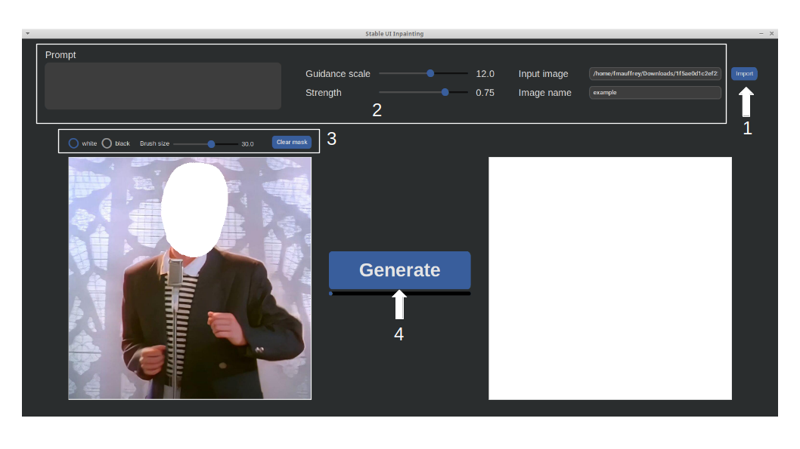

# StableDiffusion-UI

Simple UI for stable diffusion using DirectML (https://gist.github.com/averad/256c507baa3dcc9464203dc14610d674) 
made with tkinter. Two UI are available, for classic text to image generation and for inpainting.

## Use

After installing Stable diffusion following @averad instructions, simply download the 3 scripts in the same folder.
Some dependencies are required (see below).

## Dependencies
Install the following dependencies in the same environment you created then execute:
```
# Modern layout for tkinter
pip install customtkinter
pip install numpy
```

## Main GUI

To start the GUI, activate the environment then run the gui.py script.
```
sd_env\scripts\activate
python gui.py
```

All images are saved in the images folder and in the corresponding subfolder. All images are generated with a size of 512*512. The image canvas of the ui display images at this size and might not be very appropriate for variations mode. Don't hesitate to look directly at the image file in the variations subfolder for a better view. 

### Render
This mode aims at rendering the best image once you found an appropriate seed, prompt and parameters. You can also just use it to generate any image.

### Explore
Use the explore mode to quickly find the appropriate seed for a specific prompt. This mode will generate 4 images with different and random seeds and displays all the images with the corresponding seeds.
You should use a low number of inference steps in this mode to quickly generate the 4 images and then use the best seed in render or variations mode.

### Variations
This mode allows to generate the same image with some variations and plot them in a grid. Use it after finding a good seed. Do not use random seed (-1) in this mode.
For each category, separate the different values by a comma "," with no spaces.
For the prompt and negative prompt category, use $REPLACE in your text to designate the term to replace.

## Inpainting GUI

To start the GUI, activate the environment then run the gui_inpainting.py script.
```
sd_env\scripts\activate
python gui_inpainting.py
```



1. Import you image. It will be resized to 512*512 automatically and displayed in the left canvas.
2. Choose the parameters for inpainting. The image will be saved in the /images/inpainting folder under the name given 
as output.
3. Paint on the image directly in the canvas. Inpainting will target only white areas. All pixel that are not pure white
will be converted into black to create the mask. To avoid inpainting in white areas of your image, you can also paint
in black.
4. Generate the new image with the given parameters. Once generated, it will be displayed in the right canvas.
